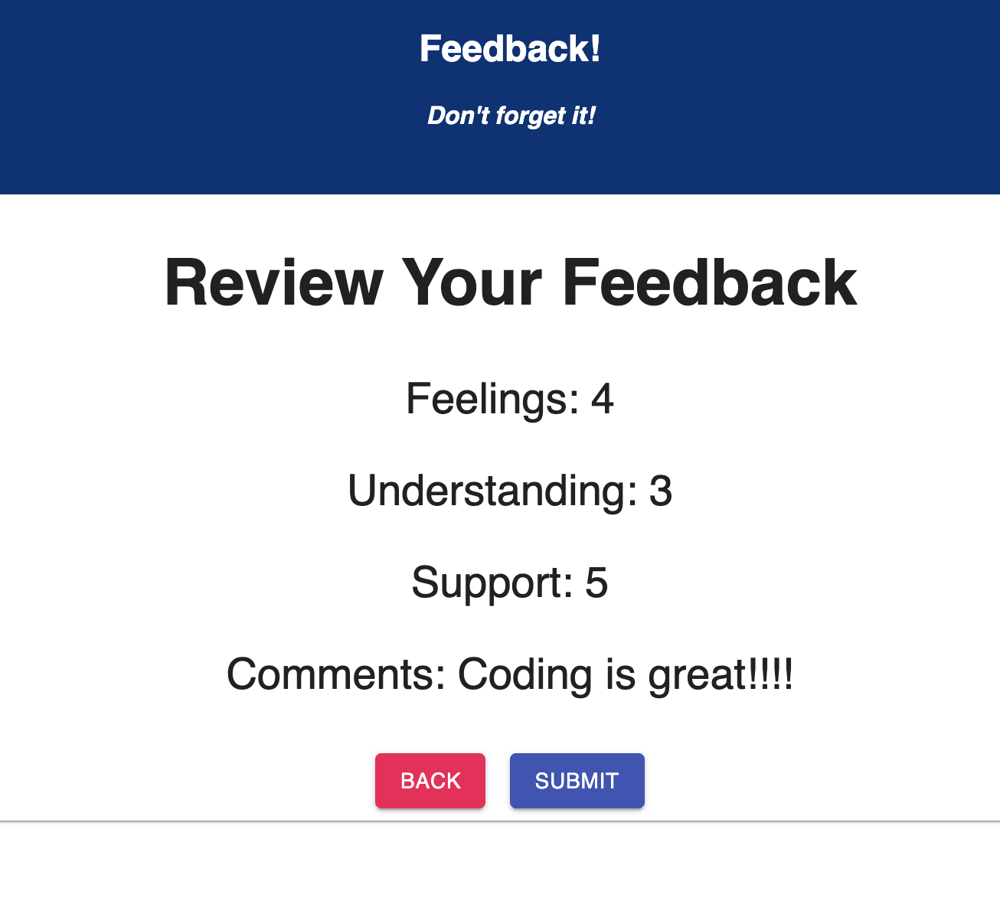

# Redux-Feedback-Loop

## Description
For this weekend project (#5), we were given the task of creating an application that allows the user to enter feedback about how they are feeling, how well they are comprehending the material, and how supported they feel.  Comments can also be added, but are not required.  The user is able to navigate through this loop and submit their results for that day.  Their results are then stored in a local database, for safekeeping.

## Screen Shot

#### Home page View

#### Review View

## Prerequisites

-   Node.js
-   PG
-   PostgreSQL

## Installation

1. In your editor of choice, navigate to the main project directory, open your terminal and type `npm install` in the command line, in order to install the dependencies for this project
2. Run `npm run server` in your terminal (to spin up server; this has been set up for you)
3. Open an additional terminal (clicking the + in your open terminal), and run `npm run client` (localhost will automatically open in your default browser)

## Usage

1. Enter a number 1-5 (required) for how you are feeling today.  Once your value has been entered, click the next button to move to the     next page.
2. Repeat step 1 for the next two pages (understanding and support).  You may click the back button to update/change a value on a           previous page.
3. After clicking next on the support page, you will be brought to the comments page.  Comments are not required, but encouraged.  Once     your comments have been added (if desired) click the next button to move to the review page.
4. Review your selections.  If changes are needed, click the back button to navigate back to the selection that needs to be changed.        When your selections are as desired, click the Submit button to save your results.
5. Submitting your results will navigate you to a page that informs the user that their feedback has been successfully added.  Click the    "Leave new feedback" to begin the loop all over!

## Built With
-   node.js
-   express.js
-   React
-   CSS
-   Material-UI
-   Redux
-   PG

## Acknowledgement
Huge thanks to Prime Digital Academy(Minneapolis), my instructor, Mary, and my cohort, Trifid!

## Support
No longer being supported... designed for learning purposes
